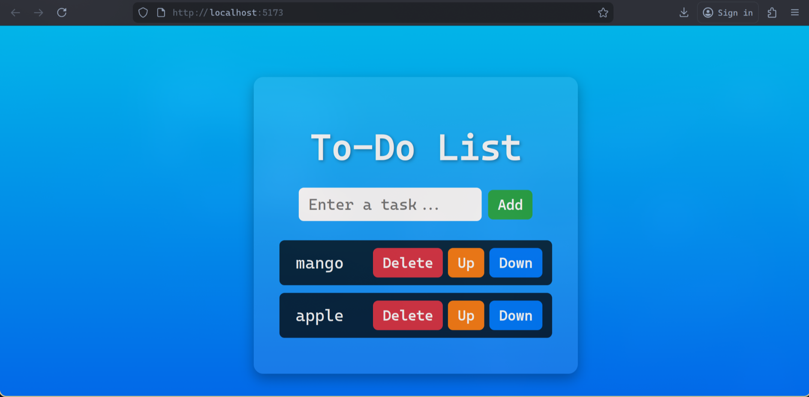

# React To-Do List

A simple To-Do List application built with React. Users can:

- Add tasks
- Delete tasks
- Move tasks up and down
- Press Enter to add tasks quickly

---

## Screenshot

> Replace `screenshots/todo-screenshot.png` with the path to your screenshot.  
> You can create a `screenshots/` folder in your project and put one image there.
